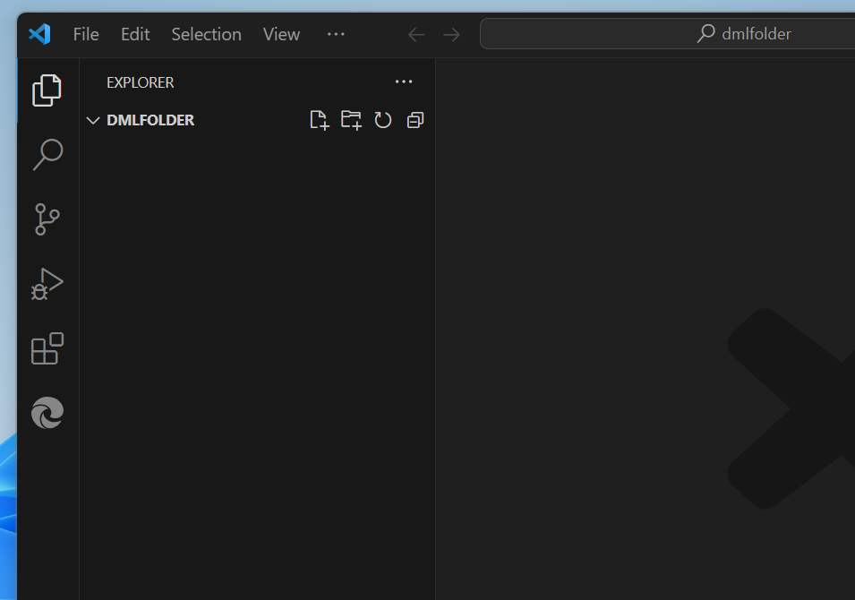
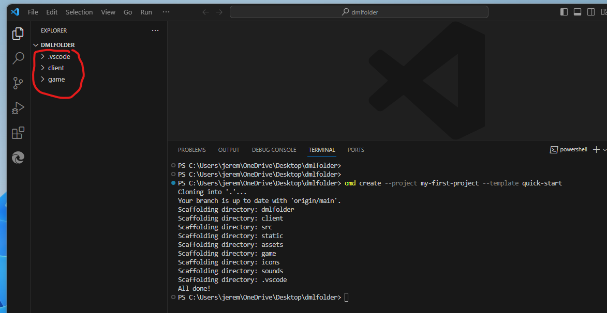
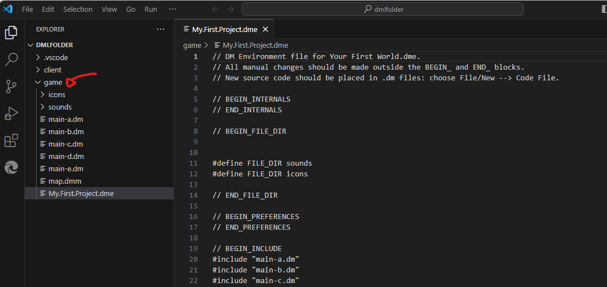
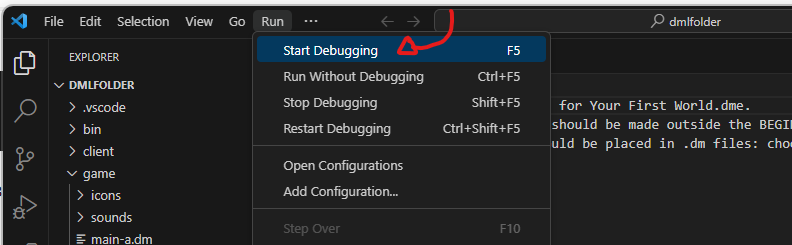
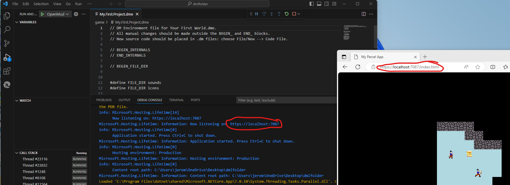

# Creating a Project
Using the OpenMud command line and the Visual Studio Code IDE, creating a new OpenMud project is easy. This page steps you through creating your first project with OpenMud.

## Creating the Project

1. Open Visual Studio Code, and navigate to an empty folder where you would like to save your project. (File -> Open Folder) You should end up in an empty directory with Visual Studio Code, as seen below:

2. Open the Command Terminal in Visual Studio Code by using the menu item `View -> Terminal` and execute the command 

    `omd create --project my-first-project --template quick-start`
    
    You should see 3 directories created:
     * game (This is where all of your game code & assets will be saved)
     * client (The client project. You can leave this alone to use the default client code)
     * .vscode (Contains some default Visual Studio Code tasks for building and debugging)

3. Expanding the game folder, you can see the source files and assets for your game. For the typical use of OpenMud, all your code will go here and you will not need to concern yourself with any code outside of this folder.

4. The OpenMud template also includes all of the default build, run and debug configurations with VS Code. You can compile and run your game by just using the  `Run -> Start Debugging` menu option in Visual Studio Code.

4. After selecting "Start Debugging", omd will build and start hosting your game server. When it is ready, it will be available on https://localhost:7087 ; The "Debug Console" will print out the address the game is being hosted when the server is ready.

