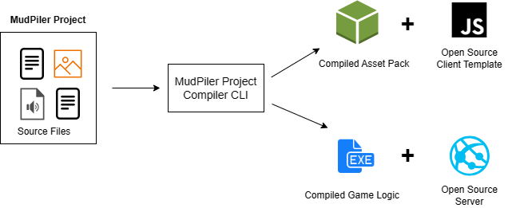

# Introduction

OpenMud is a tool that enabled experienced and in-experienced developers to quickly collaborate and build out multiplayer worlds. Specifically, OpenMud aims to support Open Source game development in a way that allows highly collaborative and continuously evolving games.

OpenMud involves developing games in a similar way to the Byond Game Engine, however OpenMud is open source, more portable, open-source, easily extensible and open-source.

## Quickstart Guide

Without digging into too many details, quickly dive into OpenMud by following the **[installation and quick-start guides.](/docs/category/getting-started)**

## A Survery of OpenMud

While the OpenMud Command-Line shields you from the intricacies of how OpenMud operates, you can delve into this section to gain some insight into the inner workings of OpenMud.

OpenMud comprises a myriad of components that, when combined, empower you to craft multiplayer game worlds. In this section, we'll provide a high-level overview of OpenMud.

### The OpenMud Compiler (Mudpiler)
Using OpenMud to design your game, you will write and design your game in a programming language called the "Dream Maker Language". Together with the source files of your project, you will also have audio and image files stored together in a **OpenMud Project**.

When you are ready to build and test your game, you will use the OpenMud command-line (omd) to trigger the MudPiler, which will compile your game source files into two separate components:
1. A Client Component, which is highly portable and can execute in your webbrowser, or any other platform
2. A Server Component which can execute on either Windows or Linux systems and manages the online instance of your game.

Once your game is ready to test, you will compile your Project using the MudPiler, which will produce two separate artefacts
  * The Asset Package, contains all of your front-end game assets (images, audios etc.) These asset files are then loaded into the open source client template, which can connect to your game server.
  
  * The Compiled Game Logic assembly contains all of your game logic. This is loaded into an instance of the open-source OpenMud server, which hosts your game and simulates the game world consistent to the logic defined in the Game Logic assembly.

The Open Source Client Template is designed to function with all MudPiler Games, but it is only a template. The front-end can be easily customized (adding additional GUI elements, or changing the look and feel of the game.)

## Supporting the Development of OpenMud

OpenMud is very excited to encourage and accept community engagement. There are lots of ways you can help:
1. Extending the DML Framework is very simple. The DML Framework is the built-in functionality associated to various objects in the game. For example, a /mob may have a default movement. For information on expanding the DML Framework, please read the section 'DML Framework'

2. Try and run various games written in Dream Maker Language, let us know of any issues your encounter! You can create a ticket on the GitHub issues page with some sample code, and it can be picked up and resolved.

3. Writing documentation is extremely valuable and if anyone has time to devote to documentation, it will always be appreciated. For contributing to documentation, see section "Contriburing to the Docs"

4. Write a tutorial on how to use OpenMud. The best documentation we can provide is documentation that shows you how to use OpenMud, so any effort is very much appreciated.

6. Write Test Cases if you find an issue. Even if you aren't sure exactly how to fix it, by creating a test case, we can easily reproduce the issue and someone can pick it up and resolve the issue.